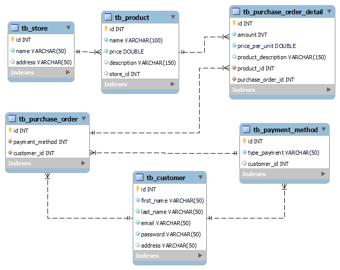

# UVEG-TBD
## UVEG TBD_U1_Reto1: SGBDAnálisis

Se adjunta archivo de configuración inicial **docker-compose.yml**
Para la creación de un contenedor **Docker** con **MySQL** para la realización de laboratorios de bases d edatos.

Para la creación del contenedor se sugiere lo siguiente.

Clonar el repositorio

``
git clone https://github.com/LeonardoGutierrezV/UVEG-TBD_U1
``

Acceder a la ubicación del repositorio

``
cd UVEG-TBD_U1
``

Crear el contenedor

`` 
docker-compose u
``

La IP para acceder al servicio dentro del contenedor regularmente es: 172.29.48.1
O se encuentra dentro del segmento 172.29.48.*, en caso de no poder acceder con esta IP puede ejecutar la consulta.

`` ps
arp -a 
``

Y ubicar la IP dentro del segmento indicado

## UVEG TBD_U2_Reto 2. Crear mi primera base de datos

En el caso especícifo de que el contenedor este fuera de línea, podemos inicializarlo con el siguiente comando.

``
docker start uveg-mysql
``

En caso de ser necesario y para efectos de tener acceso al sistema operativo del contenedor podemos ejecutar el siguiente comando.

``
docker exec -it uveg-mysql /bin/bash -l
``

Se debe crear la base de datos store en el SGBD Workbench para la empresa Electronic
Technologies; asimismo crea las tablas store y products. 

`` CREATE DATABASE db_store; ``

Seestablece el esquema en el que vamos a trabajar.

`` USE db_store; ``

Se requiere crear las siguientes tablas.

**Tabla: customer**

Con las siguientes características.

|Nombre de la columna	|Tipo de dato	|Null	|Primary Key	|
|-----------------------|---------------|-------|---------------|
|id			|INT		|false	|true		|
|first_name		|VARCHAR(50)	|false	|false		|
|last_name		|VARCHAR(50)	|false	|false		|
|email			|VARCHAR(50)	|false	|false		|
|password		|VARCHAR(50)	|false	|false		|
|address		|VARCHAR(50)	|true	|false		|
|phone			|VARCHAR(50)	|true	|false		|

``
CREATE TABLE tb_customer 
( id INT NOT NULL PRIMARY KEY,
  first_name VARCHAR(50) NOT NULL,
  last_name VARCHAR(50) NOT NULL,
  email VARCHAR(50) NOT NULL,
  password VARCHAR(50) NOT NULL,
  address VARCHAR(50) 
);
``

**Tabla: payment method**

Con las siguientes características.

|Nombre de la columna	|Tipo de dato	|Null	|Primary Key	|
|-----------------------|---------------|-------|---------------|
|id			|INT		|false	|true		|
|type_payment		|VARCHAR(50)	|false	|false		|

``
CREATE TABLE tb_payment_method
( id INT NOT NULL PRIMARY KEY,
  type_payment VARCHAR(50) NOT NULL
);
``

Se determina que la la tabla requiere asociarse a la tabla customer, entonces se procede a agregar una columna para dicha asosiación.

``
ALTER TABLE tb_payment_method ADD COLUMN  customer_id INT;
``

Se requerirá tambien crear una clave foranea para establecer una relación entre las tablas.

``
ALTER TABLE tb_payment_method
ADD CONSTRAINT fk_type_payment
FOREIGN KEY (customer_id)
REFERENCES tb_customer ( id );
``

**Tabla: purchase order**

Con las siguientes características.

|Nombre de la columna	|Tipo de dato	|Null	|Primary Key	|Foreign key	|
|-----------------------|---------------|-------|---------------|---------------|
|id			|INT		|false	|true		|false		|
|payment_method_id	|INT		|false	|false		|true		|
|customer_id		|INT		|false	|false		|true		|

``
CREATE TABLE tb_purchase_order
( id INT NOT NULL PRIMARY KEY,
  payment_method INT NOT  NULL,
  customer_id INT NOT NULL, 
  CONSTRAINT fk_po_type_payment FOREIGN KEY (payment_method) REFERENCES tb_payment_method (id),
  CONSTRAINT fk_po_customer FOREIGN KEY (customer_id) REFERENCES tb_customer (id)
);
``

**Tabla: store**

Con las siguientes características.

|Nombre de la columna	|Tipo de dato	|Null	|Primary Key	|Foreign key	|
|-----------------------|---------------|-------|---------------|---------------|
|id			|INT		|false	|true		|false		|
|name			|VARCHAR(50)	|false	|false		|false		|
|address		|VARCHAR(50)	|true	|false		|false		|

``
CREATE TABLE tb_store
( id INT NOT NULL PRIMARY KEY,
  name VARCHAR(50) NOT NULL,
  address VARCHAR(50)
);
``

**Tabla: product**

Con las siguientes características.

|Nombre de la columna	|Tipo de dato	|Null	|Primary Key	|Foreign key	|
|-----------------------|---------------|-------|---------------|---------------|
|id			|INT		|false	|true		|false		|
|name			|VARCHAR(100)	|false	|false		|false		|
|price			|DOUBLE		|false	|false		|false		|
|description		|VARCHAR(150)	|true	|false		|false		|
|store_id		|INT		|false	|false		|true		|

``
CREATE TABLE tb_product
( id INT NOT NULL PRIMARY KEY,
  name VARCHAR(100) NOT NULL,
  price DOUBLE NOT NULL,
  description VARCHAR(150),
  store_id INT,
  CONSTRAINT fk_pr_store FOREIGN KEY (store_id) REFERENCES tb_store (id)
);
``

**Tabla: purchase_order_detail**

Con las siguientes características.

|Nombre de la columna	|Tipo de dato	|Null	|Primary Key	|Foreign key	|
|-----------------------|---------------|-------|---------------|---------------|
|id			|INT		|false	|true		|false		|
|amount			|INT		|false	|false		|false		|
|price_per_unit		|DOUBLE		|false	|false		|false		|
|product_description	|VARCHAR(150)	|true	|false		|false		|
|product_id		|INT		|false	|false		|true		|
|purchase_order_id	|INT		|false	|false		|true		|

``
CREATE TABLE tb_purchase_order_detail
( id INT NOT NULL PRIMARY KEY,
  amount INT NOT NULL,
  price_per_unit DOUBLE NOT NULL,
  product_description VARCHAR(150),
  product_id INT NOT NULL,
  purchase_order_id INT NOT NULL,
  CONSTRAINT fk_pod_product FOREIGN KEY (product_id) REFERENCES tb_product (id),
  CONSTRAINT fk_pod_purchase_order FOREIGN KEY (purchase_order_id) REFERENCES tb_purchase_order(id)
);
``

Debiendo obtener el siguiente reultado.

Una vez completada la creación de la base de daos debera generarse un script llamado **script-uveg.sql** para dar por concluida esta parte.

